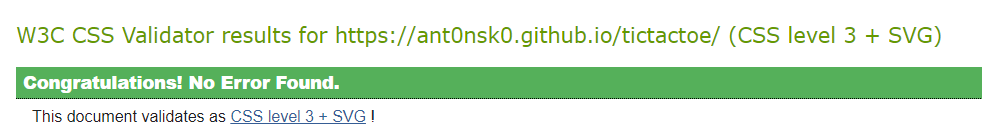

# Tic Tac Toe  
On this site users can play Tic Tac Toe, either with a friend or against the computer. The site is targeted towards people who simply want a quick game of Tic Tac Toe, whether they are alone or not.  

  

## Features  
+ Game Select  
When arriving on the site the user is welcomed by a window asking whether you like to play versus another player or versus the computer. This modal dims the background while open.  

  

+ Game Board  
After making a decision the user is presented with the header and the game board and is allowed to make the first move. The user will notice that when hovering over a tile with the mouse, the current players symbol will be shown indicating who's turn it is.  

  
  
  

+ Game Over Screen  
After winning, losing or ending in a draw the user is presented with a game over screen stated the winner and asking whether they would like to play again or change the game mode.  
  

## Future Features  
Future features might include a score counter, difficulty settings and sound.  
___
## Testing  
Tests were performed on the following devices and browsers:  
+ Desktop / Laptop:
    + Chrome with dev tools
    + Mozilla Firefox
    + Microsoft Edge  
+ Android: Samsung Galaxy A22 4G
    + Chrome
    + Samsung Internet
    + Duck Duck Go  

On all of the above, the design of the site looks as intended. Users with a slightly bigger screen get a slightly bigger game board. Game logic functioned properly except for instance described below. 

### Bugs found during testing:  
+ Having set a cursor:pointer in CSS for the game board gave the game board an odd blue flash when clicked on my mobile device. Removing the styled cursor solved the issue.  
+ Odd case where if player and computer both falls on winning combinations, the game over screen would not display the correct winner. Currently looking into the issue.  

### Google Lighthouse Audit  
  

### Validator Testing  

+ HTML

    + There is no errors going through [W3C Validator](https://validator.w3.org/nu/?doc=https%3A%2F%2Fant0nsk0.github.io%2Ftictactoe%2F)
+ CSS

    + There is no errors going through [W3C Jigsaw Validator](https://jigsaw.w3.org/css-validator/validator?uri=https%3A%2F%2Fant0nsk0.github.io%2Ftictactoe%2F&profile=css3svg&usermedium=all&warning=1&vextwarning=&lang=en)
+ Javascript
    + There is no errors going through [JSHint](jshint.com)
    + The following metrics were returned:
        + There are 16 functions in this file.
        + Function with the largest signature takes 1 argument, while the median is 0.5.
        + Largest function has 20 statements in it, while the median is 2.
        + The most complex function has a cyclomatic complexity value of 10 while the median is 1.  

### Unfixed Bugs  
+ Bug found during testing were if both the player and the computer lands on a winning condition, the game over screen would display the wrong winner. Currently looking into it.  

## Deployment  
This project was deployed to GitHub Pages.
To do so:

1. Go to the repository on GitHub.
2. Click on "Settings".
3. On this page scroll down to find "Pages" located in the bar to the left.
4. Click "Source" and choose "main".
5. Click on "Save"
A link will show up, wait for it to load and then click on it to go to the deployed page.
The live link can be found here: https://ant0nsk0.github.io/tictactoe/  

## Credits  
+ The code for the base game was adopted from a tutorial from [Coding with Adam](https://www.youtube.com/watch?v=fPew9OI2PnA)
+ Font is from [Google Fonts](https://fonts.google.com/specimen/Righteous)