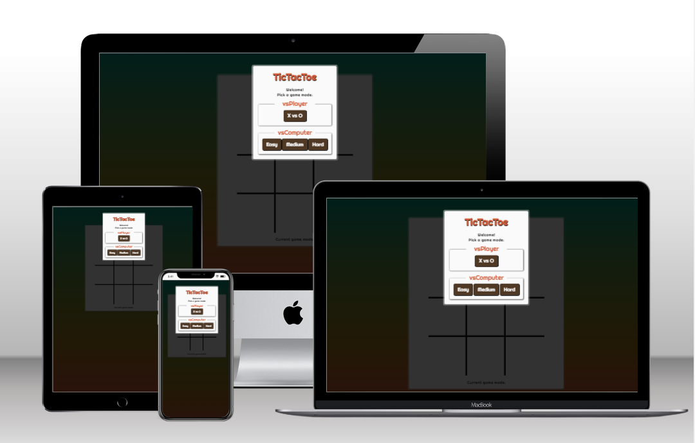

# Tic Tac Toe  
On this site users can play Tic Tac Toe, either with a friend or against the computer. The site is targeted towards people who simply want a quick game of Tic Tac Toe, whether they are alone or not.  

  

## Features  
+ Game Select  
When arriving on the site the user is welcomed by a window asking whether they would like to play versus another player or versus the computer. Playing versus the computer has three difficulties; easy, medium and hard. This modal dims the background while open.  
  

+ Game Board  
After making a decision the user is presented with the header with a score counter underneath followed by the game board and is allowed to make the first move. The user will notice that when hovering over a tile with the mouse, the current players symbol will be shown indicating who's turn it is.      
  
The user can, if they wish, click on the header to flip the colors of the page.  
  
  
Under the game area is a text displaying the current game mode.

+ Game Over Screen  
After winning, losing or ending in a draw the user is presented with a game over screen stating the winner and asking whether they would like to play again or change the game mode.  
  

+ Winner highlight and score  
The winners position will be highlighted and the score will go up.  
  

## Future Features  
Future features might include the minimax algorithm, symbol selection and sound.  

## Testing  
Tests were performed on the following devices and browsers:  
+ Desktop / Laptop:
    + Chrome with dev tools
    + Mozilla Firefox
    + Microsoft Edge  
+ Android: Samsung Galaxy A22 4G
    + Chrome
    + Samsung Internet
    + Duck Duck Go  

On all of the above, the design of the site looks as intended during testing of responsiveness at various sizes. Users with a slightly bigger screen get a slightly bigger game board. Game logic functioned properly in all browsers / devices tested. 

*Tests included but are not limited to:*

| Game Type | Test Description | Steps / Process | Expected Results | Actual Results |  |
|---|---|---|---|---|---|
| vs Player | Check that all empty tiles are clickable and adds the correct letter | 1. Start game by selecting vs player 2. Click each tile for X, making sure X can be at any empty spot 3. Click each tile for O, making sure O can be at any empty spot | Each click sets the correct letter. | Each click sets the correct letter. |  |
| vs Computer | Check that all empty tiles are clickable and adds the correct letter | 1. Start game by selecting vs computer 2. Click each tile available, making sure both the computer and player can be at any empty spot. | Each click and computer move sets the correct letter. | Each click and computer move sets the correct letter. |  |
| vs Player  | Check that all win conditions are working and displaying the correct winner. | 1. Start game by selecting vs player  2. Click each tile for all win conditions for X, making sure the correct winner is displayed. 3. Click each tile for all win conditions for O, making sure the correct winner is displayed. | All win conditions are working and displaying the correct winner. | All win conditions are working and displaying the correct winner. |  |
| vs Computer | Check that all win conditions are working and displaying the correct winner. | 1. Start the game by selecting vs computer 2. Click each tile for all win conditions for x, making sure the correct winner is displayed. 3. Click each tile baiting the computer to pick spots for all win conditions, making sure the correct winner is displayed. | All win conditions are working and displaying the correct winner. | Initial winner display was false when computer turn fired after player had won. Fixed the issue by stopping the computer from firing after a win. Every following test has resulted in all win condition working and displaying the correct winner. |  |
| vs Player | Check that play again button on game over screen plays the correct game. | 1. Start the game by selecting vs player 2. Play the game until win, lose or draw. 3. Click play again on game over screen, making sure that the correct game type plays. | When clicking the play again button, start a new game of the same type. | When clicking the play again button, start a new game of the same type. |  |
| vs Computer | Check that play again button on game over screen plays the correct game. | 1. Start the game by selecting vs computer. 2. Play the game until win, lose or draw. 3. Click play again on game over screen, making sure that the correct game type plays. | When clicking the play again button, start a new game of the same type.  | When clicking the play again button, start a new game of the same type. |  |
| vs Player  | Check that game over screen displays draw correctly.  | 1. Start the game by selecting vs player. 2. Click tiles resulting in a draw, making sure the game over screen says draw. | When game is a draw, game over screen displays draw. | When game is a draw, game over screen displays draw. |  |
| vs Computer | Check that game over screen displays draw correctly. | 1. Start the game by selecting vs computer. 2. Play until draw, making sure that the game over screen displays draw. | When game is a draw, game over screen displays draw. | When game is a draw, game over screen displays draw. |  |
| Both | Check that change mode button lets the user change modes | 1. Start the game by selecting a game mode 2. Play until win, lose or draw. 3. On game over screen press change mode, making sure it shows game modes again | When clicking the change mode button, brings back player to game mode selection. | When clicking the change mode button, brings back player to game mode selection |  |

### Bugs found during testing:  
+ Having set a cursor:pointer in CSS for the game board gave the game board an odd blue flash when clicked on my mobile device. Removing the styled cursor solved the issue.  
+ Odd case where if player and computer both falls on winning combinations, the game over screen would not display the correct winner. Fixed the issue by writing an if statement stopping the computers turn from firing if a win condition has been met.  

### Google Lighthouse Audit  
  

### Validator Testing  

+ HTML

    + There is no errors going through [W3C Validator](https://validator.w3.org/nu/?doc=https%3A%2F%2Fant0nsk0.github.io%2Ftictactoe%2F)
+ CSS

    + There is no errors going through [W3C Jigsaw Validator](https://jigsaw.w3.org/css-validator/validator?uri=https%3A%2F%2Fant0nsk0.github.io%2Ftictactoe%2F&profile=css3svg&usermedium=all&warning=1&vextwarning=&lang=en)
+ Javascript
    + There is no errors going through [JSHint](jshint.com)
    + The following metrics were returned:
        + There are 21 functions in this file.
        + Function with the largest signature takes 1 argument, while the median is 0.
        + Largest function has 36 statements in it, while the median is 2.
        + The most complex function has a cyclomatic complexity value of 62 while the median is 1.  

### Unfixed Bugs  
+ No known unfixed bugs. 

## Deployment  
This project was deployed to GitHub Pages.
To do so:

1. Go to the repository on GitHub.
2. Click on "Settings".
3. On this page scroll down to find "Pages" located in the bar to the left.
4. Click "Source" and choose "main".
5. Click on "Save"
A link will show up, wait for it to load and then click on it to go to the deployed page.
The live link can be found here: https://ant0nsk0.github.io/tictactoe/  

## Credits  
+ The code for the core game was adopted and altered from following a tutorial from [Coding with Adam](https://www.youtube.com/watch?v=fPew9OI2PnA). This includes pieces like checking win conditions, hovertext, vsPlayer and game board structure and additional lines (see comments by code) that was based upon/adopted, altered, and modified from the tutorial. 
+ Font is from [Google Fonts](https://fonts.google.com/specimen/Righteous)